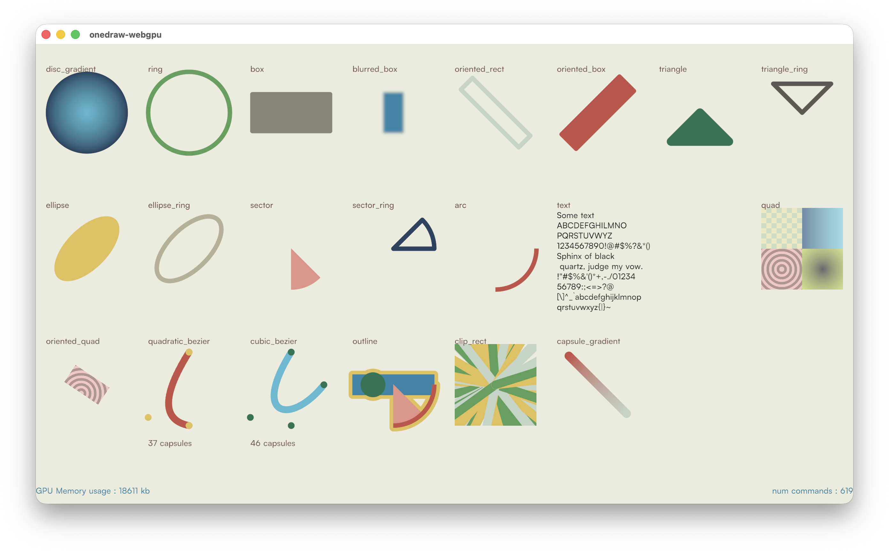

# onedraw-webgpu
webGPU GPU driven 2d sdf renderer drop-in library

## GPU-driven sdf 2D renderer drop-in library

onedraw-webgpu is designed to render everything in a single draw call, maximizing GPU efficiency for 2D graphics. It uses webGPU natively and has only one .c file to make it easy to integrate. It has been tested on macOS and Windows.

## Screenshot

## Features
* Single draw call rendering, all primitives are drawn in one draw call.
* Tile-based binning : a compute shader processes only the primitives that influence each tile, reducing wasted work.
* Shader-based alpha blending : all blending operations are handled in the shader, no framebuffer read/write required.
* Anti-aliasing :  smooth edges using signed distance functions.
* Lightweight and minimal : drop-in library with minimal dependencies, everthing in C11
* Baked font, ready-to-use debug text rendering 
* Wide shape support : box, blurred box, rectangle, oriented box/rectangle, triangle, triangle ring, disc, circle, ellipse, arc, sector, textured quad, oriented textured quad.
* Shape operations : union
* Outline

## Upcoming features
* Hierarchical tile binning : compute shaders to pre-filter tile commands lists at a high level (8x4 regions for the whole screen)
* More shape operation : subtraction, intersection

## Integration

* Copy all files from the /lib folder.
* Add onedraw.c to your build system.
* Create your window and provide the webgpu device and surface
* Link with WebGPU framework

## Build

Follow the step to build and run the unit test program:

* cmake -B build -S .
* cmake --build build
* ./build/unit_tests

**Note:** the unit test uses PSNR to validate results against a reference.
